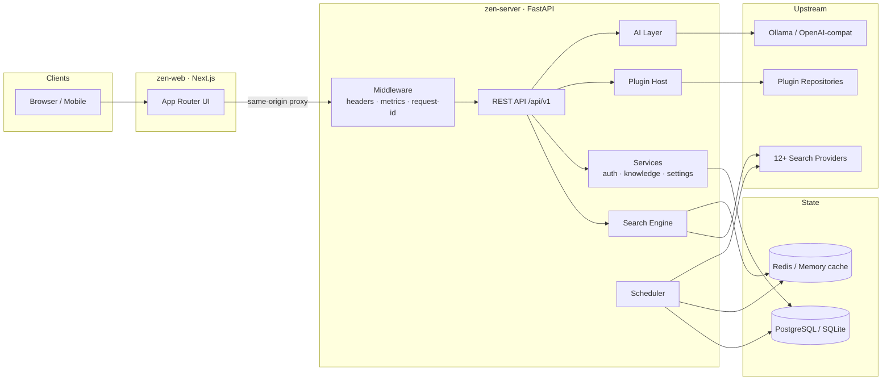
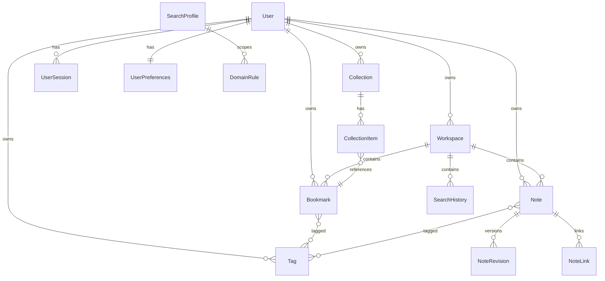

# Architecture overview

## Request path for a search

1. `GET /api/v1/search?q=…` → rate limit → session resolution (CSRF on writes).
2. **Bang check** — `!gh foo` short-circuits to a redirect response.
3. **Profile resolution** — explicit param → user default → instance default.
4. **Provider selection** — registry ∩ admin-enabled ∩ profile ∩ mode ∩
   circuit-breaker state.
5. **Concurrent execution** — one shared httpx client, per-provider timeout
   envelopes, single retry on transient failures. Failures isolate.
6. **Pipeline** — normalize (clean text, canonicalize URLs, strip tracking
   params) → merge/dedupe across providers (www/scheme-insensitive keys) →
   enrich (favicon proxy URLs).
7. **Ranking** — Reciprocal Rank Fusion extended with provider weights,
   domain rules (instance/profile/user), and personal signals. Pinned domains
   float; blocked domains drop.
8. **Mode post-processing** — Focus filters distraction domains; Research
   tags the workspace; Privacy skipped steps 7's personal signals and skips
   history/caching entirely.
9. Response includes per-provider status so the UI can be honest about
   partial coverage.

## Domain model

Key decision: bookmarks and saved search results are **one entity**
([ADR-0008](decisions/0008-unified-knowledge-object.md)) with optional search
provenance.

## Configuration layers

See [ADR-0003](decisions/0003-three-layer-configuration.md). Short version:
env vars boot the process, the `instance_settings` table drives behavior (DB-
backed, cached, cluster-invalidated), `user_preferences` never affects others.

## Package map (backend)

| Package | Responsibility |
|---|---|
| `zen.core` | Settings, security primitives, cache abstraction, rate limiting, exceptions |
| `zen.db` | Engine management, ORM models (users/knowledge/search/system) |
| `zen.search` | Provider framework + 12 built-ins, pipeline, ranking, modes, bangs, health, engine |
| `zen.services` | Auth, users, workspaces, bookmarks, collections, tags, notes, history, profiles, settings, export, audit, bootstrap |
| `zen.ai` | Backend abstraction (Ollama/OpenAI-compatible) + capability service |
| `zen.plugins` | SDK, manifest validation, loader, lifecycle manager, repositories |
| `zen.api` | FastAPI routes + dependencies (auth/CSRF/rate-limit) |
| `zen.workers` | In-process scheduler + periodic tasks |
| `zen.observability` | structlog config, Prometheus metrics |

## Frontend

Next.js App Router. All API calls go same-origin through the Next server
(`/api/v1/*` rewrite → backend), so cookies are first-party and no CORS is
needed. State: TanStack Query for server state, two small Zustand stores for
auth/UI. Components are hand-rolled shadcn-style on Tailwind tokens; themes
are CSS variables (light/dark/AMOLED) with a no-flash inline script.
